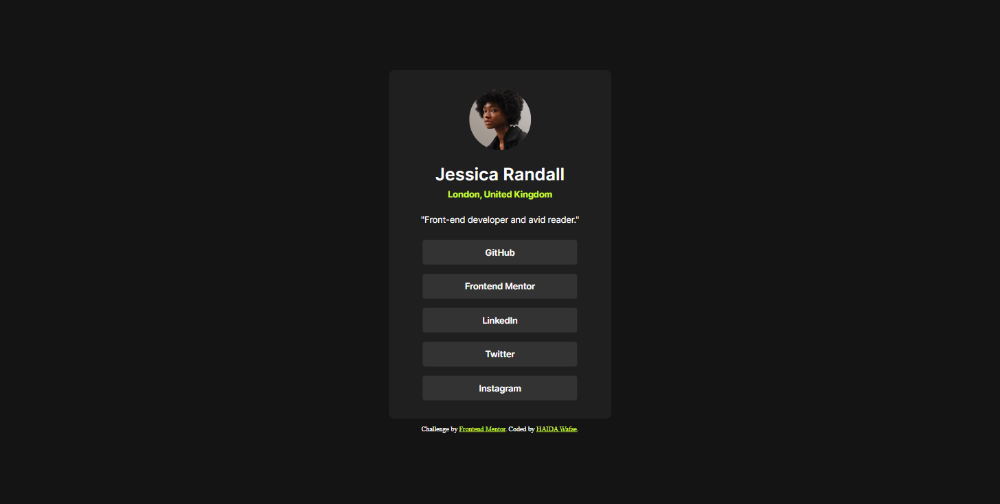

# Frontend Mentor - Social links profile solution

This is a solution to the [Social links profile challenge on Frontend Mentor](https://www.frontendmentor.io/challenges/social-links-profile-UG32l9m6dQ).

## Table of contents

- [Overview](#overview)
  - [The challenge](#the-challenge)
  - [Screenshot](#screenshot)
  - [Links](#links)
- [My process](#my-process)
  - [Built with](#built-with)
  - [What I learned](#what-i-learned)
  - [Continued development](#continued-development)
  - [Useful resources](#useful-resources)
- [Author](#author)

## Overview

### The challenge

Users should be able to:

- See hover and focus states for all interactive elements on the page

### Screenshot



### Links

- Live Site URL: https://wafae-haida.github.io/Social-links-profile-Project/

## My process

### Built with

- Semantic HTML5 markup
- CSS custom properties (including border radius and RGBA colors)
- Flexbox (including centering techniques)
- Mobile-first workflow
- Hover effects and custom cursor styles

### What I learned

In this project, I learned how to create hover effects and change cursor themes using CSS. I also figured out how to use external fonts beyond the standard CSS fonts, and convert lists into buttons. Changing image borders was another skill I picked up. This experience solidified my knowledge in building responsive layouts, and now I'm eager to delve deeper into CSS technology to discover and learn even more.

```html
<h1>Some HTML code I'm proud of</h1>
    <h1 class="name">Jessica Randall</h1>
    <p class="location">London, United Kingdom</p>
    <p class="description">"Front-end developer and avid reader."</p>
    <div class="list-buttons">
      <ul>
        <li>GitHub</li>
        <li>Frontend Mentor</li>
        <li>LinkedIn</li>
        <li>Twitter</li>
        <li>Instagram</li>
      </ul>
    </div>
```
```css
.proud-of-this-css 🎉{
  @font-face {
    font-family: 'Inter Bold';
    src: url('./assets/fonts/static/Inter-Bold.ttf') format('truetype');
    font-weight: 700;
  }
  .list-buttons ul{
    display: flex;
    align-items: center;
    justify-content: center;
    flex-direction: column;
    gap: 15px;
    list-style: none; 
    padding: 0;
    margin: 0;
  }
  .list-buttons li:hover{
    background-color:hsl(75, 94%, 57%);
    cursor: pointer;
    color: black;
  }
}
```

### Continued development

As a beginner in creating responsive pages, I've learned to use HTML and CSS for foundational web development. I'm excited to tackle more complex challenges with multiple components. I'll focus on mastering Flexbox and Grid layouts, refining media queries, and building reusable components like navigation bars and modals.

### Useful resources

- [Copilot] - This helped me understand and refine my web development skills. I really liked the clear explanations and practical advice, and I will definitely use these patterns going forward. Huge thanks to my trusty AI companion for guiding me through the process! 🌟
- [Inter font](https://github.com/rsms/inter) - Inter has been an invaluable resource for me. Its design enhances readability and aesthetics in my web projects, making it a go-to for creating visually appealing and user-friendly layouts.

## Author

- Website - [Portfolio](http://haida.my-style.in/?i=1)
- Frontend Mentor - [@wafae-haida](https://www.frontendmentor.io/profile/wafae-haida)
- Linkedin - [Wafae haida](https://www.linkedin.com/in/wafae-haida/?originalSubdomain=ma)
